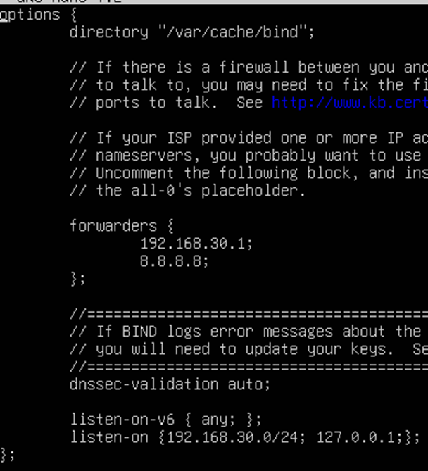
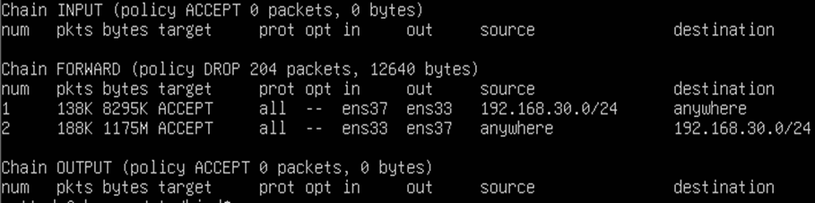
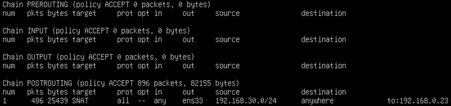
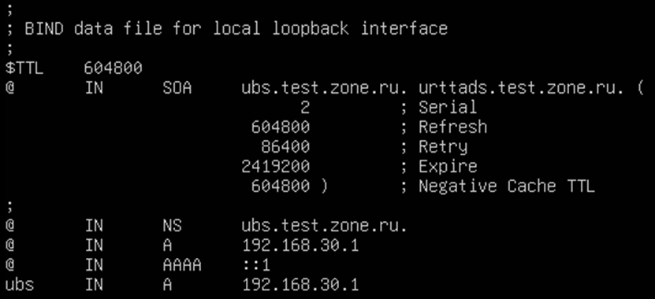
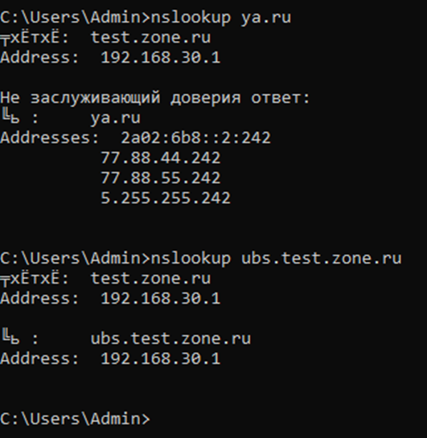

# Лабораторная работа №1
## Тема: «Настройка сервера Linux ( Ubuntu server ) в качестве DHCP и DNS сервера с фунцией маршрутизации»
## Цель: получить навыки работы и настройки Ubuntu Server’a.
## Выполнить отчет по данной работе:
#### 1. Вставить скриншоты конфигурационных файлов и результаты выполнения пунктов.
#### 2. Описать работу используевых команд и дополнительных параметров.
#### 3. Ответить на контрольные вопросы

<span style="color:red">Внимание: Не используйте айпи адресса и доменные имена представленные в порядке работы, иначе будете переделывать работу. Придумывайте свое сетевое пространство.</span>

## Порядок работы:
### 1)	Настроить сетевые интерфейсы на виртуальных машинах
</img>
#### a.	Первая машина Ubuntu server
`i.	Первый порт Bridge`

`ii.	Второй порт LAN`
#### b.	Вторая машина Windows
`i.	Единственный порт LAN`

### 2)	Настроить DHCP сервер на Ubuntu server со следующими параметрами:
#### a.	В качестве днс и шлюза выдавать айпи сервера

#### b.	Пул выдаваемых адресов по вашему усмотрению

### 3)	Настроить DNS сервер:
#### a.	В файле named.conf.options сделать по аналогии как на рисунке, описать то что вы там написали.
</img>

#### 192.168.30.1 - это должен быть адрес вашего ubuntu server со стороны `LAN`
#### 8.8.8.8 - меняется на 10.0.20.2 dns который доступен из сети колледжа
#### 192.168.30.0/24 - меняется на ip и масску вашей `локальной` подсети

### 4)	Настройка интернет-шлюза
#### Виртуальная машина Ubuntu должна обеспечивать выход в интернет для всех компьютеров из локальной сети. По умолчанию транзитный трафик отключен, так что редактируем файл `/etc/sysctl.conf:`
```sh
sudo nano /etc/sysctl.conf
```
#### Раскоментировать строку: `net.ipv4.ip_forward=1`
#### Чтобы внесенные изменения вступили в силу:
```sh
sudo sysctl -p /etc/sysctl.conf
```
#### После этого настраиваем netfilter с помощью утилиты iptables:
```sh
sudo iptables -P FORWARD DROP
```
#### Далее идут команды в которых нужно прописывать `СВОИ ДАННЫЕ`
```sh
sudo iptables -A FORWARD -i enp0s8 -o enp0s3 -s 192.168.30.0/24 -j ACCEPT
```
```sh
sudo iptables -A FORWARD -i enp0s3 -o enp0s8 -d 192.168.30.0/24 -j ACCEPT
```
#### Параметр `-i` задает порт на который будут приходить пакеты
#### Параметр `-o` задает порт c которого будут отправлятся пакеты
#### Параметр `-s` указывает отправителя этих пакетом
#### Параметр `-d` указывает получателя этих покетов
### И смотрим, что получилось:
</img>

#### Мы разрешили ходить транзитным пакетам для нашего диапазона ip-адресов, а всё остальное запретили.
#### Теперь настроим `SNAT` (подмена адреса источника), что позволит всем компьютерам сети выходить в интернет, используя единственный ip-адрес
#### Далее идут команды в которых нужно прописывать `СВОИ ДАННЫЕ`
```sh
sudo iptables -t nat -A POSTROUTING -s 192.168.30.0/24 -o enp0s3 -j SNAT --to-source 192.168.110.8
```
### И смотрим, что получилось:
```sh
sudo iptables -t nat -L -v --line-numbers
```
</img>

#### Теперь проверяем наличие интернета на виртуальных машинах

### 5)	Настройка прямой и обратной зоны DNS
#### Cоздадим зону DNS
#### Добавьте информацию о зоне в конфигурацию
```sh
sudo nano /etc/bind/named.conf.local
```
#### Затем добавьте следующие строки
#### Далее идут команды в которых нужно прописывать `СВОИ ДАННЫЕ`

```sh
zone "domain-name.com" {
        type master;
        file "/etc/bind/db.domain-name.com";
        allow-transfer { 10.1.1.10; };
        also-notify { 10.1.1.10; };
};
```
#### `domain-name.com` меняется на название вашей придуманной доменной зоны
#### 10.1.1.10 меняется на ip адресс Ubuntu servera со стороны `LAN`

### Выполните перезапуск службы

```sh
systemctl reload bind9
```

#### Конфигурационный файл зоны
#### Создайте файл зоны из шаблона и откройте его.

```sh
sudo cp /etc/bind/db.local /etc/bind/db.domain-name.com
sudo nano /etc/bind/db.domain-name.com
```

#### Замените `localhost` в записи SOA полным доменным именем вашего сервера с указанием «.» в конце.
#### А `root.localhost` замените на свой действующий адрес электронной почты администратора с указанием «.» вместо «@» и «.» в конце.

</img>

#### Перезапустите rndc

```sh
sudo rndc reload
```

### !!! Самостоятельно реализовать обратную зону днс
#### В результате пользователь на виндовс сервере должен получить айпи адресс с сервера Ubuntu и быть обеспеченным интернетом, при выполнении команды nslookup сервер Ubuntu будет первым сервером на пути к сайту, а так же должен пинговаться не только с помощью айпи но и с помощью доменного имени

</img>
