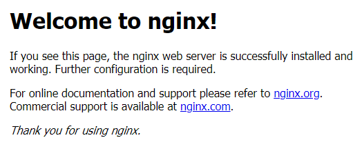

# Лабораторная работа №3
## Тема: «Настройка веб сервера Nginx
## Цель: получить навыки работы и настройки веб сервера 
## Выполнить отчет по данной работе:
#### 1. Вставить скриншоты конфигурационных файлов и результаты выполнения пунктов
#### 2. Описать работу используевых команд и дополнительных параметров
#### 3. Ответить на контрольные вопросы

## Порядок работы:
### 1)	Непосредственно перед установкой обновим данные репозитория, для этого введём в терминале:

```sh
apt update
```

### 2)	Когда обновлённые данные о наличии пакетов загрузятся, можно приступить к установке:

```sh
apt install nginx
```

### 3)	Программа установлена, добавим её в список ПО, которое автоматически запускается сразу после запуска системы:

```sh
systemctl enable nginx
```

### 4)	Теперь нужно убедиться, что процессы завершились успешно, ПО установлено, заработало корректно и есть в списке автозапуска:

```sh
service nginx status
```

### 5) Выполнить проверку — перейти по IP-адресу сервера в браузере. Если в окне отобразится приветственная страница, то установка прошла правильно.

</img>

### 6) Найдите где хранится стандартый файл html и замените его на свой и проверте работоспособность