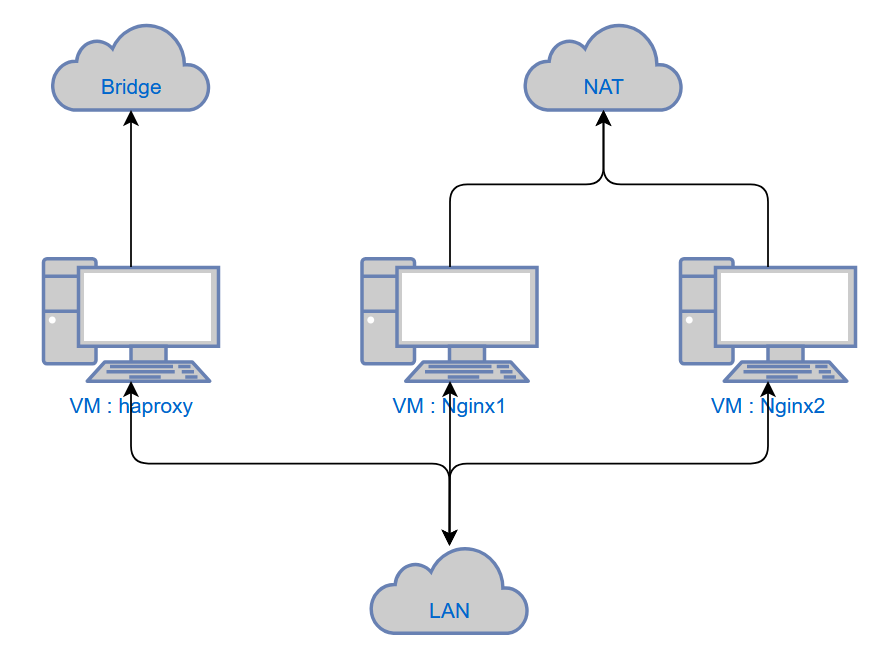
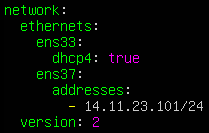

# Лабораторная работа №7
## Тема: «Настройка HAProxy»
## Цель: получить навыки работы c прокси сервером HAProxy
## Выполнить отчет по данной работе:
#### 1. Вставить скриншоты конфигурационных файлов и результаты выполнения пунктов
#### 2. Описать работу используевых команд и дополнительных параметров

## Порядок работы:

### 1)	Непосредственно перед установкой обновим данные репозитория, для этого введём в терминале:

```sh
sudo apt update
```

### 2) Для выполнения данной лабораторной работы вам потребуется три UBUNTU SERVER
#### ЛОГИЧЕСКАЯ ТОПОЛОГИЯ выглядит следующим образом:



#### haproxy - это главный сервер обеспечивающий функцию распределения ресурсов между остальными службами
#### nginx1 и nginx2 - это новые VM на которых будут развертаны службы веб-серверов
### VM имеют по два порта:
#### haproxy : (1) Bridge для доступа в интернет и доступа к нему из сети аудитории (2) LAN для соединения VM в единую сеть
#### nginx1 : (1) NAT для доступа в интернет (2) LAN для соединения VM в единую сеть
#### nginx2 : (1) NAT для доступа в интернет (2) LAN для соединения VM в единую сеть

### 3) Подготовка VM nginx

#### 1. Настроить порты



#### Так как в данных VM первый порт NAT нам ничего настраивать не нужно, все за нас сделает DHCP сервер встроенный в гипервизор
#### Второму порту выдаем IP из нашей локальной подсети ( на примере это подсеть 14.11.23.0/24 )
#### Выполнить настройку на обоих серверах nginx

#### 2. Установка nginx

```sh
sudo apt install nginx -y
```

### 4) Подготовка VM haproxy

#### Так как после выполнения предыдущих работ у вас уже был установлен nginx который занимает 80 порт, который необходим для работы haproxy, нам необходимо отключить службу nginx и убрать ее из автозагрузки.

```sh
sudo systemctl stop nginx
sudo systemctl disable nginx
```

#### После проверить доступ до других VM в локальной сети путем команды ping

### 5) Установка haproxy

```sh
sudo apt install haproxy -y
```

### 6) Конфигурация haproxy

#### После выполнения всех настроек и загрузки haproxy можно перейти к настройке
#### Сделайте копию конфигурационного файла haproxy:

```sh
sudo cp /etc/haproxy/haproxy.cfg /etc/haproxy/haproxy.backup
```

#### Откройте конфигурационный файл

```sh
sudo nano /etc/haproxy/haproxy.cfg
```

#### Те настройки, которые уже объявлены в конфигураторе, мы изменять не будем.
### Все команды дописываем в конце файла !!!

#### Для начала укажем, что HAProxy будет принимать все входящие подключения на 80 порт:

```sh
frontend website
       bind :80
```

#### В качестве бэкенд-серверов у нас будут два сервера с nginx - укажем их отдельно:

```sh
backend static
       server static1 14.11.23.201:80

backend main
       server main1 14.11.23.101:80
```

#### Сервера объявлены - теперь настроим правила балансировки. Расширим блок с объявлением frontend-сервера в конфигурационном файле - укажем, что если имя файла заканчивается на .jpg или .png, запрос должен уйти на сервер для статики, все остальное пусть обрабатывает основной сервер:

```sh
frontend website
       bind :80
       use_backend static if { path_end .jpg .png }
       default_backend main
```

#### Сохраним конфиг и перезапустим HAProxy:

```sh
sudo systemctl restart haproxy
```

### 7) Дополнительные действия

#### Теперь когда у нас настроен прокси сервер нам необходимо добавить файлы на сервера nginx для проверки работоспособности

### Nginx1

#### Создадим новый файл index.html в стандартной директории nginx /var/www/html и допишем туда следующий код:


### Nginx2

#### Загрузим в директорию /var/www/html фотографию в формате jpg под названием которое указанно в пути в index.html

### 8) Проверка работоспособности

#### Перейдите в браузере по IP сервера haproxy (Со стороны bridge если подлючаетесь с основной Windows) и вы увидите следующую страницу:


#### Как мы видим страница открывается, а рисунок подгружается с другого сервера

### 9) Самостоятельное выполнение

#### Какую страницу вы увидите, если вы укажите в конфигурационном файле haproxy в `server static1` и `server main1` ip от nginx1, прикрепить скрин результата