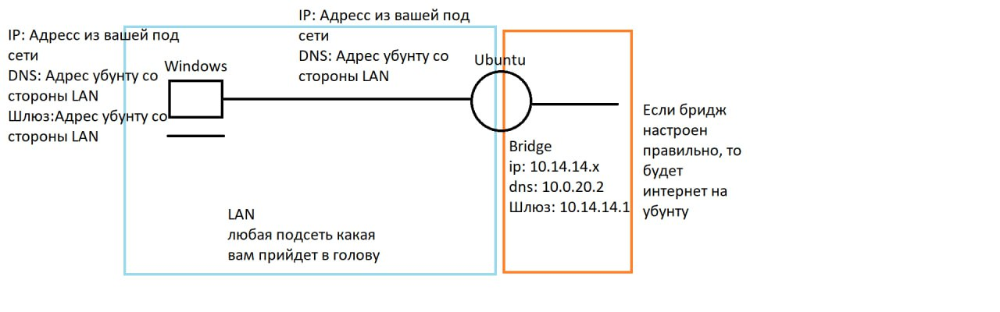

# Лабораторная работа №1
### Тема: «Настройка сервера Linux ( Ubuntu server ) в качестве DHCP и DNS сервера с фунцией маршрутизации»
### Цель: получить навыки работы и настройки Ubuntu Server’a.
### Выполнить отчет по данной работе:
#### 1. Вставить скриншоты конфигурационных файлов и результаты выполнения пунктов.
#### 2. Описать работу используевых команд и дополнительных параметров.
#### 3. Ответить на контрольные вопросы

<span style="color:red">Внимание: Не используйте айпи адресса и доменные имена представленные в порядке работы, иначе будете переделывать работу. Придумывайте свое сетевое пространство.</span>

### Порядок работы:
#### 1)	Настроить сетевые интерфейсы на виртуальных машинах
</img>
#### a.	Первая машина Ubuntu server
`i.	Первый порт Bridge`

`ii.	Второй порт LAN`
#### b.	Вторая машина Windows
`i.	Единственный порт LAN`

#### 2)	Настроить DHCP сервер на Ubuntu server со следующими параметрами:
#### a.	В качестве днс и шлюза выдавать айпи сервера

#### b.	Пул выдаваемых адресов по вашему усмотрению

#### 3)	Настроить DNS сервер:
#### a.	В файле named.conf.options сделать по аналогии как на рисунке, описать то что вы там написали.
</img>

#### 4)	Настройка интернет-шлюза
#### Виртуальная машина Ubuntu должна обеспечивать выход в интернет для всех компьютеров из локальной сети. По умолчанию транзитный трафик отключен, так что редактируем файл `/etc/sysctl.conf:`
```
sudo nano /etc/sysctl.conf
```
#### Раскоментировать строку: `net.ipv4.ip_forward=1`
#### Чтобы внесенные изменения вступили в силу:
```
sudo sysctl -p /etc/sysctl.conf
```
#### После этого настраиваем netfilter с помощью утилиты iptables:
```
sudo iptables -P FORWARD DROP
```
#### Далее идут команды в которых нужно прописывать `СВОИ ДАННЫЕ`
```
sudo iptables -A FORWARD -i enp0s8 -o enp0s3 -s 192.168.30.0/24 -j ACCEPT
```
```
sudo iptables -A FORWARD -i enp0s3 -o enp0s8 -d 192.168.30.0/24 -j ACCEPT
```