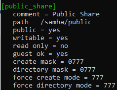

Лабораторная работа №3
## Тема: «Настройка SMB 'Samba'
## Цель: получить навыки работы и настройки SMB
## Выполнить отчет по данной работе:
#### 1. Вставить скриншоты конфигурационных файлов и результаты выполнения пунктов
#### 2. Описать работу используевых команд и дополнительных параметров

## Порядок работы:

### 1)	Непосредственно перед установкой обновим данные репозитория, для этого введём в терминале:

```sh
apt update
```

### 2) Перейдем непосредственно к установке Samba на Ubuntu. Отправим в терминал команду:

```sh
sudo apt install samba -y
```

### 3) Если в настраиваемой системе включен брандмауэр ufw, необходимо добавить разрешающее правило для Samba:

```sh
sudo ufw allow Samba
```

### 4) Лучше скопировать файл конфигурации по умолчанию, чтобы всегда оставлять себе возможность откатиться до дефолтных настроек Samba на Ubuntu. Копируем командой:

```sh
sudo cp /etc/samba/smb.conf /etc/samba/res_smb.conf
```

## Настройка анонимного доступа к директории

### 1) Создадим директорию, к которой будет предоставлен доступ:
`Убедитесь что вы в домашней директории`

```sh
sudo mkdir /samba/public
```

#### Если не получается создавайте папки по отдельности:

```sh
sudo mkdir samba
cd samba
sudo mkdir public
```

### 2) Добавим директории полные права для всех:

```sh
sudo chmod 777 /samba/public
```
### 3) Следующим шагом будут внесены изменения в директивы конфигурационного файла, в данной инструкции для этих целей использован текстовый редактор nano.

```sh
sudo nano /etc/samba/smb.conf
```
#### Добавим в файл следующий директивы:

</img>

#### В отчет добавить описание каждого из параметров

### 4) После внесения изменений перезапускаем демона Samba:

```sh
sudo systemctl restart smbd
```

### 5) Проверить работоспособность путем захода на SMB с Windows
#### Обязательно предоставить скриншот
