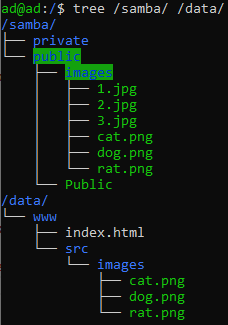

Лабораторная работа №3
## Тема: «Рассширенная работа с Nginx»
## Цель: получить навыки работы и продвинутой настройки Nginx
## Выполнить отчет по данной работе:
#### 1. Вставить скриншоты конфигурационных файлов и результаты выполнения пунктов
#### 2. Описать работу используевых команд и дополнительных параметров

## Порядок работы:

### 1)	Непосредственно перед установкой обновим данные репозитория, для этого введём в терминале:

```sh
apt update
```

### 2) Техническое задание

### После выполнения работ связанных с установкой и настройкой Nginx и Samba вам необходимо проделать следующие действия перед выполнением текущей работы:

#### 1) Скачать на сервер файлы расположенные тут ==> <a href="src/img/lb6/forlab">клик<a/>

#### 2) Организовать следующие расположение файлов: 



### 3) Настройка nginx

#### С помощью документации расколоженной по ссылке ==> <a href="https://nginx.org/ru/docs/beginners_guide.html">клик<a/> 
#### Организовать следующие действия:
##### При переходе на сайт у вас должна открываться страница расположенная по пути `/data/www`
##### При дописывании `/images/` в ссылку у вас должна идти перессылка на файлы расположенных по пути 