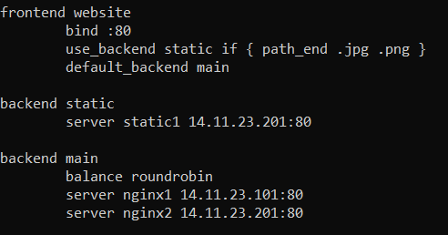

# Лабораторная работа №8
### Тема : HAProxy - балансировка нагрузки
**Выполнить отчет по данной работе:**  
```
- Вставить скриншоты конфигурационных файлов и результаты выполнения пунктов  
- Описать работу используевых команд и дополнительных параметров
```

### Цель : Научится конфигурировать прокси сервер для распределение нагрузки между серверами
---
### Порядок работы :

1. Изменить конфигурационный файл HAProxy следующим образом:  
  
Как вы можете заметить изменился `backend main` теперь с помощью него мы можем настроить балансировку нагрузки между двумя веб-серверами  
    - `balance roundrobin` - указывает на способ балансировки ресурсов, в данном случае указан способ, который будет перебрасывать входящие запросы по переменке и каждый раз при перезагрузки страницы мы будем попадать на разный сервер
    
    - `server nginx1 14.11.23.101.:80` и `server nginx2 14.11.23.201.:80` указывают сервера на которые мы можем перенаправить запрос  
    
    p.s. Все изображения также подгружаются только со второго сервера

2. Измените стандартные html странички nginx  
Реализуйте следующие странички:  
  
  
Одна страница распологается на сервере nginx1, другая nginx2  
Все картинки распологаются на сервере nginx2  
`ВСТАВИТЬ СКРИН ГДЕ ВИДНО ЧТО СКРИНШОТЫ ТОЛЬКО НА ОДНОМ СЕРВЕРЕ`


3. Самостоятельно найти другой метод балансировки и протестировать его, описать алгоритм его работы